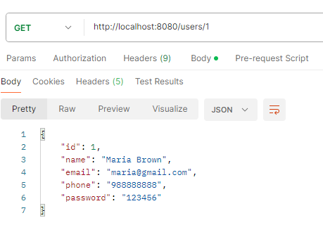

# Projeto de Exemplo - Serviço Web RESTful

Este é um projeto de exemplo que demonstra a criação de um serviço web RESTful usando o Spring Framework em Java. O objetivo deste serviço é fornecer funcionalidades relacionadas à gestão de categorias, pedidos, produtos e usuários.

##Funcionalidades

* ###Categorias:

* Listar todas as categorias disponíveis.
GET http://localhost:8080/categories

* Obter detalhes de uma categoria específica por meio de seu ID.
GET http://localhost:8080/categories/{id}

* ###Pedidos:

* Listar todos os pedidos.
GET http://localhost:8080/orders

* Obter detalhes de um pedido específico por meio de seu ID.
GET http://localhost:8080/orders/{id}

* ###Produtos:

* Listar todos os produtos disponíveis.
GET http://localhost:8080/products

* Obter detalhes de um produto específico por meio de seu ID.
GET http://localhost:8080/products/{id}

* ###Usuários:

* Listar todos os usuários.
GET http://localhost:8080/users

* Obter detalhes de um usuário específico por meio de seu ID.
GET http://localhost:8080/users/{id}

* Inserir um novo usuário.
POST http://localhost:8080/users

* Atualizar informações de um usuário existente.
PUT http://localhost:8080/users/{id}

* Excluir um usuário existente.
DELETE http://localhost:8080/users/{id}

